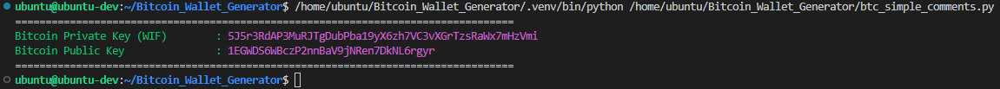
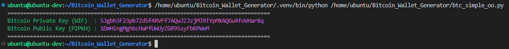
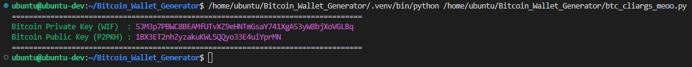
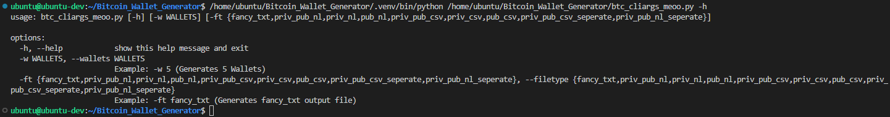
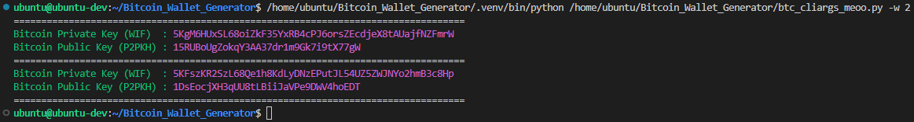
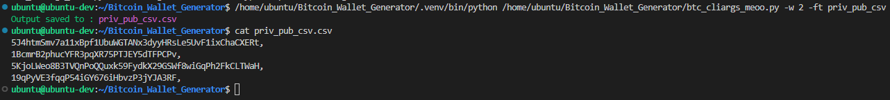

<div id="top"></div>

<!-- PROJECT LOGO -->
<br />
<div align="center">
  <a href="https://github.com/CyberSlothMiko/Bitcoin_Wallet_Generator">
    
  </a>
  <p align="center">
    Generate (P2PKH) Bitcoin Main-net Wallets in WIF.
  </p>
</div>


<!-- TABLE OF CONTENTS -->
<details>
  <summary>Table of Contents</summary>
  <ol>
    <li>
      <a href="#about-the-project">About The Project</a>
      <ul>
        <li><a href="#built-with">Built With</a></li>
      </ul>
    </li>
    <li>
      <a href="#getting-started">Getting Started</a>
      <ul>
        <li><a href="#prerequisites">Prerequisites</a></li>
        <li><a href="#installation">Installation</a></li>
      </ul>
    </li>
    <li><a href="#usage">Usage</a></li>
    <li><a href="#license">License</a></li>
    <li><a href="#acknowledgments">Acknowledgments</a></li>
  </ol>
</details>


<!-- ABOUT THE PROJECT -->
## About The Project

I have always wondered how Bitcoin Wallets were generated and decided what better way to learn then to see if i could generate one myself!.

There were quite a few iterations along the way and a few variations and considerations too.

<div align="center"><h3>Example Output</h3></div>
<div align="center"><h4>btc_simple_comments</h4></div>
<div align="center">
  
</div>
<div align="center"><h4>btc_simple_oo</h4></div>
<div align="center">
  
</div>
<div align="center"><h4>btc_cliargs_meoo default output</h4></div>
<div align="center">
  
</div>
<div align="center"><h4>btc_cliargs_meoo help menu</h4></div>
<div align="center">
  
</div>
<div align="center"><h4>btc_cliargs_meoo -w flag </h4></div>
<div align="center">
  
</div>
<div align="center"><h4>btc_cliargs_meoo -w flag and -ft flag</h4></div>
<div align="center">
  
</div>

<p align="right">(<a href="#top">back to top</a>)</p>


## Built With

* [Python](https://www.python.org/)

<p align="right">(<a href="#top">back to top</a>)</p>


<!-- GETTING STARTED -->
## Getting Started

This program was tested and built inside an Ubuntu environment.
### Prerequisites
Python3
* RHEL / Fedora
  ```sh
  sudo yum install python3
  sudo dnf install python3
  ```
* Ubuntu
  ```sh
  sudo apt install python3
  ```

### Installation

1. Clone the repo
   ```bash
   git clone https://github.com/cyberslothmiko/Bitcoin_Wallet_Generator.git
   ```
2. Change into Bitcoin_Wallet_Generator directory
   ```bash
   cd Bitcoin_Wallet_Generator
   ```
3. Run the included python env setup script
   ```bash
   ./build.sh
   ```

<p align="right">(<a href="#top">back to top</a>)</p>


<!-- USAGE EXAMPLES -->
## Usage

After following the insillation instructions above, you can run the following:

1. Enter the python3 venv (This example is from inside `Bitcoin_Wallet_Generator` directory)
   ```bash
   . .venv/bin/activate
   ```
2. Running the `btc_simple_*` scripts
   ```bash
   python3 btc_simple_comments.py
   python3 btc_simple_oo.py
   ```
3. Running the `btc_cliargs_*` script examples     
   ```bash
   python3 btc_cliargs_meoo.py                        # Default output to console
   python3 btc_cliargs_meoo.py -h                     # Displays the help information for the script & options for the -ft flag
   python3 btc_cliargs_meoo.py -w 3                   # Default output to console with -w flag to generate 3 wallets
   python3 btc_cliargs_meoo.py -w 3 -ft fancy_txt     # Saves output to a file in "fancy_txt" format, -w flag to generate 3 wallets
   python3 btc_cliargs_meoo.py -w 3 -ft priv_pub_csv  # Saves output to a file in "priv_pub_csv" format, -w flag to generate 3 wallets
   ```
   List of `-ft` options:
   |Flag|Usage|
   |--|--|
   |`-ft fancy_txt`|Saves to file in Default Console output as .txt|
   |`-ft priv_pub_nl`|Saves to file `priv` and `pub` key each on new line with no delimiter as .txt|
   |`-ft priv_nl`|Saves to file `priv` key on new line with no delimiter as .txt|
   |`-ft pub_nl`|Saves to file `pub` key on new line with no delimiter as .txt|
   |`-ft priv_pub_csv`|Saves to file `priv` and `pub` key each on new line with `,` delimiter as .csv|
   |`-ft priv_csv`|Saves to file `priv` on new line with `,` delimiter as .csv|
   |`-ft pub_csv`|Saves to file `pub` on new line with `,` delimiter as .csv|
   |`-ft priv_pub_csv_seperate`|Saves to file `priv` and `pub` key each on new line with `,` delimiter as seperate .csv files|
   |`-ft priv_pub_nl_seperate`|Saves to file `priv` and `pub` key each on new line with no delimiter as seperate .csv files|

   Whats the diffrence between `btc_cliargs_tioo.py` and `btc_cliargs_meoo.py`?

   `btc_cliargs_tioo.py` is time optimized and uses lists to store the value before writing to the file (crashes could result in no data being saved)<br>
   `btc_cliargs_meoo.py` is memory optimized and writes each generated key to the file as its generated (crashes could result in some data being saved)
   
   `btc_cliargs_tioo.py` is **Significantly** faster than `btc_cliargs_meoo.py`
<p align="right">(<a href="#top">back to top</a>)</p>


<!-- LICENSE -->
## License

Distributed under the MIT License. See `LICENSE` for more information.

<p align="right">(<a href="#top">back to top</a>)</p>


<!-- ACKNOWLEDGMENTS -->
## Acknowledgments

Packages used:
* [Python SECP256K1](https://pypi.org/project/secp256k1/)
* [Python BASE58](https://pypi.org/project/base58/)

<p align="right">(<a href="#top">back to top</a>)</p>